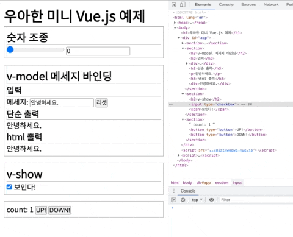

# Woowa Vue.js

우아한 mini-vue.js 입니다.

## Observable

기본적으로 pubsub 패턴 구조를 가지고 있습니다.<br />
그러나 subscribe와 update를 일일히 실행해 줄 필요는 없습니다.<br />
`ovservify()`를 통해서 원하는 객체를 `observable`하게 만들면 객체의 속성이 바뀌면 외부로 알림을 줄 수 있게 됩니다.<br />
`watch()`를 통해서 변화를 감지하고 싶은 속성을 지정해 주면 callback을 통해서 변화를 감시할 수 있습니다.

### 예시

```javascript
const o = {
  a: 10,
  b: 20,
  person: {
    name: 'kim',
    age: 28,
  },
};

observify(o);
watch(
  () => o.a + o.b,
  (newValue, oldVaue) => {
    console.log(`o.a + o.b = ${oldVaue} -> ${newValue}`);
  },
);
watch(
  () => `name: ${o.person.name}, age: ${o.person.age}`,
  (newValue, oldValue) => {
    console.log(`${oldValue} -> ${newValue}`);
  },
);

o.a = 20;
o.b = 30;

o.person.name = 'lee';
o.person.age = 30;
```

## mini vue.js

### 구현된 기능

- `v-model`을 통해서 input과 data 연결
- `v-on:event`를 통해서 원하는 event를 method와 연결
- `v-show`를 통해서 data와 `display: none`을 제어
- `v-html`을 통해서 data와 `element.innerHTML`에 연결

### 아쉽게 미구연 ㅠㅠ

- component
- `v-for`를 통한 배열 랜더

### 예시

`example` 디렉터리 안에 있는 `vue.html`와 동일한 내용입니다.

```html
<h1>우아한 미니 Vue.js 예제</h1>

<div id="app">
  <section>
    <h2>숫자 조종</h2>
    <input type="range" v-model="number" />
    <input type="number" v-model="number" />
  </section>

  <section>
    <h2>v-model 메세지 바인딩</h2>

    <h3>입력</h3>
    <div>
      메세지: <input type="text" v-model="message" />
      <button type="button" v-on:click="inputReset">리셋</button>
    </div>

    <h3>단순 출력</h3>
    <p>{{ message }}</p>

    <h3>html 출력</h3>
    <div v-html="message"></div>
  </section>

  <section>
    <h2>v-show</h2>
    <input type="checkbox" v-model="visible" />
    <span v-show="visible">보인다!</span>
  </section>

  <section>
    count: {{ count }}
    <button type="button" v-on:click="handleUpClick">UP!</button>
    <button type="button" v-on:click="handleDownClick">DOWN!</button>
  </section>
</div>

<script src="../dist/woowa-vue.js"></script>
<script>
  const vue = new WoowaVue({
    el: '#app',
    data: {
      number: 0,
      message: '안녕하세요.',
      count: 1,
      visible: true,
    },
    methods: {
      inputReset() {
        this.message = '안녕하세요.';
      },
      handleUpClick() {
        this.count += 1;
      },
      handleDownClick() {
        this.count -= 1;
      },
    },
  });
</script>
```



## 참고자료

- [jin5354/leaf-observable: Observe data & make data reactive.](https://github.com/jin5354/leaf-observable)
- [jin5354/mini-vue: mini-vue](https://github.com/jin5354/mini-vue)
- [iyolee/mini-vue: A mini Vue Framework](https://github.com/iyolee/mini-vue)

## 왜 이것을 만들었나요.

사실 이미 존재하는 수많은 자료를 보고 정리하여 작성한 코드에 불과합니다.<br />
우테캠에서 2번째 3번째 프로젝트에서 컴포넌트 베이스의 개발을 해야했는데 원래 하고 싶었던 것은 이런 것이였지만 하지 못하여 늦게나마 공부하여 만들어 보았습니다.
